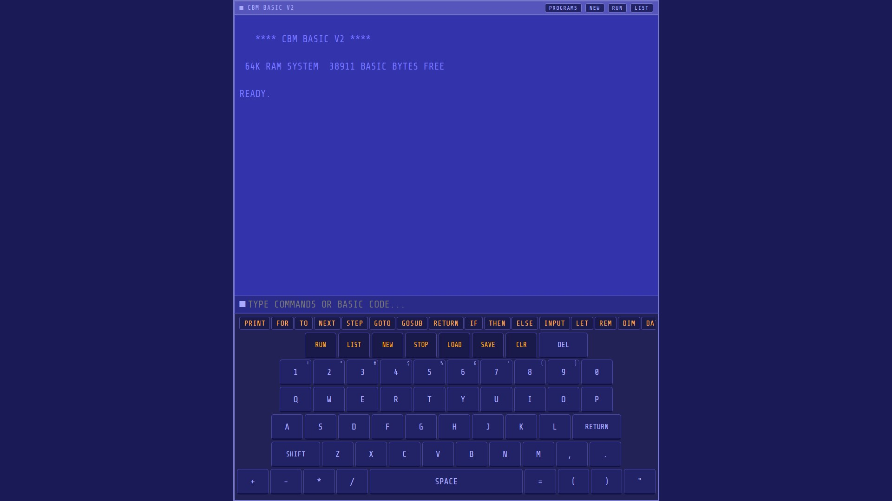

# BSDBASIC — CBM BASIC V2 Interpreter


A faithful Microsoft CBM BASIC V2 interpreter (Commodore 64 dialect) available in two flavors:

| File | Platform | Requirements |
|------|----------|--------------|
| `basic.py` | Terminal / Termux (Android) | Python 3.6+ only |
| `basic.html` | Any browser | Open in Chrome/Firefox — no install |

---

## Quick Start

### Terminal / Android Termux

```bash
# Install Python in Termux
pkg install python

# Interactive REPL
python3 basic.py

# Run a .bas file directly
python3 basic.py myprog.bas
```

### Browser (Android / Desktop)

1. Copy `basic.html` to your phone or PC
2. Open it in Chrome, Firefox, or any browser
3. Optionally: tap Menu → Add to Home Screen to install as an app

---

## Files in This Bundle

```
bsdbasic/
├── basic.py          Terminal interpreter (Python 3)
├── basic.html        Browser interpreter (single-file HTML/JS)
├── README.md         This file
├── LANGUAGE.md       Full BASIC language reference
├── CHANGELOG.md      Bug fixes and version history
└── tests/
    ├── hello.bas         Hello World
    ├── sine.bas          ASCII sine wave
    ├── countdown.bas     Countdown timer with SLEEP
    ├── fibonacci.bas     Fibonacci sequence
    ├── guess.bas         Guess-a-number game (INPUT demo)
    ├── primes.bas        Sieve of Eratosthenes (arrays + nested FOR)
    ├── stars.bas         Diamond star pattern
    ├── times.bas         Multiplication table
    ├── gosub.bas         GOSUB/RETURN subroutine demo
    ├── data.bas          DATA/READ/RESTORE demo
    ├── strings.bas       Full string function showcase
    ├── math.bas          Math function showcase
    ├── ongoto.bas        ON...GOTO branching demo
    └── fizzbuzz.bas      FizzBuzz (classic challenge)
```

---

## Shell Commands (terminal version)

| Command | Description |
|---------|-------------|
| `RUN` | Run the current program |
| `LIST` | Display all program lines |
| `NEW` | Clear program and all variables |
| `CLR` | Clear variables only (keep program) |
| `LOAD name` | Load a built-in sample or a .bas file from disk |
| `SAVE name` | Save current program to name.bas |
| `DIR` | List .bas files in current directory |
| `HELP` | Show command reference |
| `EXIT` / `BYE` | Quit the interpreter |

### Built-in Samples

```
LOAD HELLO      LOAD SINE       LOAD COUNTDOWN
LOAD FIB        LOAD GUESS      LOAD PRIMES
LOAD STARS      LOAD TIMES
```

### Writing Programs

Type a line number followed by a BASIC statement:

```
> 10 PRINT "HELLO"
> 20 FOR I=1 TO 3
> 30 PRINT I
> 40 NEXT I
> 50 END
> RUN
```

Delete a line by typing the line number alone with nothing after it.

### Immediate Mode

Any statement without a line number runs immediately:

```
> PRINT 2+2
 4
> PRINT SIN(3.14159)
```

---

## Keyboard Shortcuts (terminal)

- Up/Down arrows — Command history (requires readline)
- Ctrl+C — Break / interrupt a running program
- Ctrl+D — Exit interpreter

---

## Differences from Real C64 BASIC

- Variables are case-insensitive (A = a)
- All keywords should be uppercase
- PEEK returns 0, POKE is accepted but ignored (no hardware access)
- SLEEP n: 60 ticks = 1 second (authentic C64 timing)
- No SYS, tape/disk LOAD with device numbers, sprite graphics
- Numbers use IEEE 754 double precision (more accurate than C64's 5-byte float)
- String variables must end in $ (e.g. A$, NAME$)
- DIM A(10) gives elements 0 through 10 (11 total), matching C64 behavior

---

## Example Session

```
    **** CBM BASIC V2 ****

 64K RAM SYSTEM  38911 BASIC BYTES FREE

READY.

> 10 PRINT "WHAT IS YOUR NAME?"
> 20 INPUT N$
> 30 PRINT "HELLO, ";N$;"!"
> RUN
WHAT IS YOUR NAME?
? BIG DADDY BEAR
HELLO, BIG DADDY BEAR!

READY.
> SAVE GREET
SAVED: GREET.BAS
```

---

## All Test Programs

| File | Tests |
|------|-------|
| `tests/hello.bas` | PRINT, string literals, FOR/NEXT, semicolon |
| `tests/sine.bas` | SIN(), TAB(), FOR/NEXT STEP, expressions |
| `tests/countdown.bas` | FOR/NEXT negative STEP, SLEEP |
| `tests/fibonacci.bas` | Multi-statement lines, arithmetic |
| `tests/guess.bas` | INPUT, IF/THEN, GOTO, RND, INT |
| `tests/primes.bas` | DIM, arrays, nested FOR loops |
| `tests/stars.bas` | STRING$(), TAB, negative STEP |
| `tests/times.bas` | Nested FOR, TAB positioning, comma print |
| `tests/gosub.bas` | GOSUB, RETURN, nested subroutines |
| `tests/data.bas` | DATA, READ, RESTORE, mixed types |
| `tests/strings.bas` | LEN, LEFT$, RIGHT$, MID$, CHR$, ASC, STR$, VAL, STRING$, + |
| `tests/math.bas` | SIN, COS, TAN, ATN, SQR, EXP, LOG, ABS, INT, SGN, RND, ^ |
| `tests/ongoto.bas` | ON/GOTO, ON/GOSUB, menu-driven program |
| `tests/fizzbuzz.bas` | IF/THEN chaining, modulo via INT |
| `tests/arrays.bas` | DIM, numeric/string arrays, bubble sort, min/max |
| `tests/nested_for.bas` | 3-level nesting, triangle pattern, STEP in nested loops |
| `tests/on_goto.bas` | ON/GOTO, ON/GOSUB, out-of-range handling |

Run any of them:
```bash
python3 basic.py tests/sine.bas
python3 basic.py tests/fizzbuzz.bas
```
